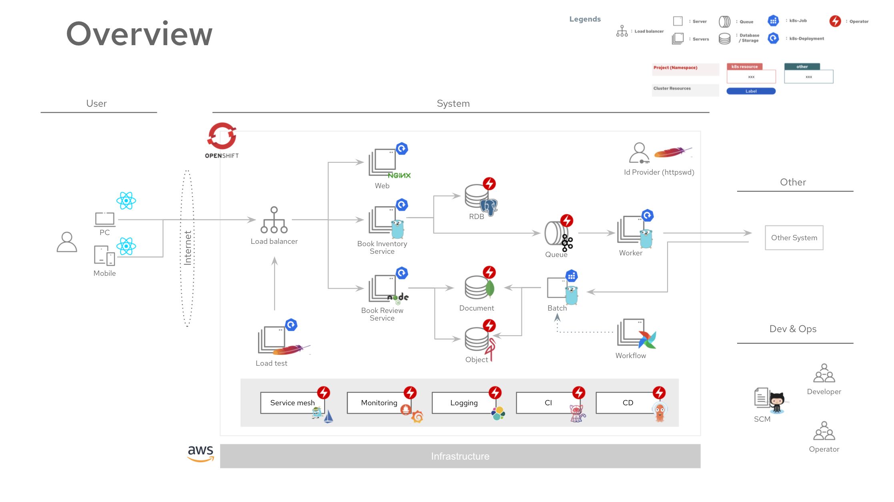
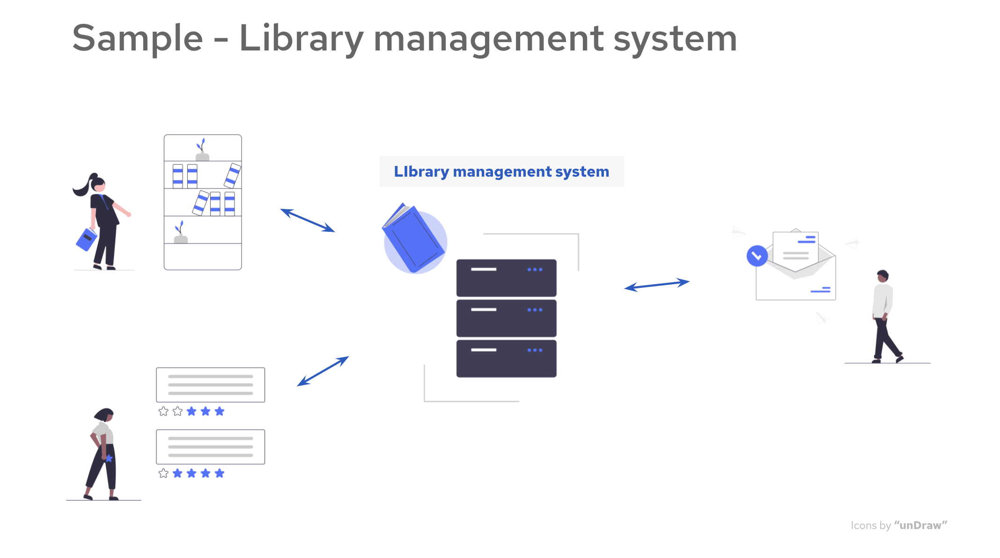

# My first OpensShift (OpenShift Sample Architecture)

The My first OpenShift is a OpenShift sample architecture. This provides a set of manifest files for deploying microservices to OpenShift cluster with devops tools.
You can deploy with only few steps with `init.sh` script.

## Requirements
* OpenShift >= 4.x
* oc client >= x.x

## Quick Start

* Clone or download this repository
* Go inside of directory, cd `my-first-openshift`
* Run this command `./init.sh`

## Overview

This is an overview of the sample architecture.



Key tech stacks are:

### Application / Middleware layer

| Component                | Stack                                                  | Deployment                                                                                                         |
|--------------------------|--------------------------------------------------------|--------------------------------------------------------------------------------------------------------------------|
| Front end                | [React](https://reactjs.org/)                          | -                                                                                                                  |
| Load balancer            | -                                                      | OpenShift resource                                                                                                 |
| Backend / Batch / Worker | [Go](https://go.dev/) / [Node.js](https://nodejs.org/) | k8s Deployment                                                                                                     |
| RDB                      | [Postgres](https://www.postgresql.org/)                | [Crunchy PostgreSQL Operator](https://catalog.redhat.com/software/operators/detail/5e9872b23f398525a0ceafc6)       |
| Document DB              | [MongoDB](https://www.mongodb.com/)                    | [MongoDB Enterprise Kubernetes](https://catalog.redhat.com/software/operators/detail/5e9872923f398525a0ceafba)     |
| Object Storage           | [MinIO](https://min.io/)                               | [MinIO Hybrid Cloud Object Storage](https://catalog.redhat.com/software/operators/detail/60945b58d3f6d18cdbac26fe) |
| Queueing                 | [Kafka](https://kafka.apache.org/)                     | [AMQ Streams](https://catalog.redhat.com/software/operators/detail/5ef20efd46bc301a95a1e9a4)                       |
| Workflow                 | [Airflow](https://airflow.apache.org/)                 | -                                                                                                                  |

### DevOps

| Component    | Stack                                                                                                                     | Deployment                                                                                                                      |
|--------------|---------------------------------------------------------------------------------------------------------------------------|---------------------------------------------------------------------------------------------------------------------------------|
| Service mesh | [Istio](https://istio.io/)                                                                                                | [Red Hat OpenShift Service Mesh](https://catalog.redhat.com/software/operators/detail/5ec53e8c110f56bd24f2ddc4)                 |
| Tracing      | [Jaeger](https://www.jaegertracing.io/)                                                                                   | [Red Hat OpenShift distributed tracing platform](https://catalog.redhat.com/software/operators/detail/5ec54a5c78e79e6a879fa271) |
| Monitoring   | [Prometheus](https://prometheus.io/) / [Grafana](https://grafana.com/)                                                    | -                                                                                                                               |
| Logging      | [Elasticsearch](https://www.elastic.co/) / [Fluentd](https://www.fluentd.org/) / [Kibana](https://www.elastic.co/kibana/) | -                                                                                                                               |
| CI           | [Tekton](https://tekton.dev/)                                                                                             | [RedHat OpenShift Pipelines](https://catalog.redhat.com/software/operators/detail/5ec54a4628834587a6b85ca5)                     |
| CD           | [ArgoCD](https://argoproj.github.io/cd/)                                                                                  | [Red Hat OpenShift GitOps](https://catalog.redhat.com/software/operators/detail/5fb288c70a12d20cbecc6056)                       |


### Resources

OpenShift and kubernetes resources are deployed as follows.


## Design documents (with lots of diagrams!😃)

This sample is an architectural design for a library management system.
* Book inventory management
* Book review
* Book arrival notification



### [I. Architecture Design](./docs/openshift-design/architecture-design.md)
1. Architectually Signicant Requirement
1. Logical architecture diagram
1. (WIP)-Design points
1. (WIP)-Physical architecture diagram


### [II. Detail Design](./docs/openshift-design/detail-design.md)
1. Projects(Namespace)
1. Security - | RBAC | Service account
1. Network - | Network diagram | Network policy
1. Pod scheduling - |
1. Quotas&Limit - |

### [III. CI/CD Design](./docs/openshift-design/cicd-design.md)
1. [Overview](./docs/openshift-design/cicd-design.md#1-overview)
1. CI-Tekton Pipeline Design
1. CD-Argo CD Setting


## Screenshots


## Repository structure
This sample architecture is composed of several GitHub repository.

```
# My First OpenShift
  -- Infrastructure
  * my-first-openshift ★This repository
    + Initial setup commands
    + OpenShift resource definitions (manifests files)
    + OpenShift Operator definitions (manifests files)
    + CI/CD setting (Tekton/ArgoCD)

  -- Applications (Sourcecode only)
  * XX-API
  * YY-API1
  * Worker
```
